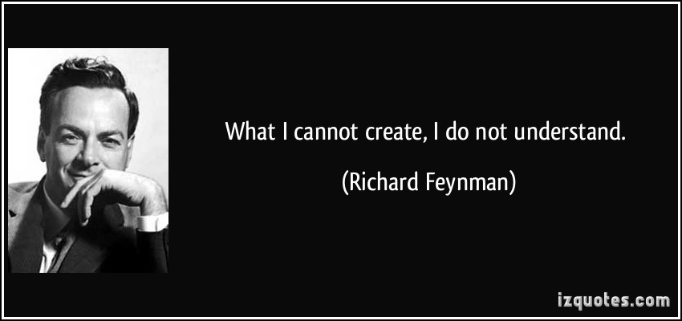

# Alienact



## What

This is a set of react-like technology stack libraries.

React, React-Router, Redux and so on will be reimplemented in a simple way (without considering performance and compatibility). These libraries contain the most common features, such as

- alienact-core(React):
  - [x] JSX
  - [x] Class Component
  - [x] Function Component
  - [x] Context API
  - [x] `ref`
  - [x] Lifecycle
  - [x] stack reconciler
  - [x] fiber reconciler
  - [ ] `key` in list
- alienact-router(React-Router):
  - [x] Router Comp
  - [x] Browser History API
  - [x] Route Comp
  - [x] Switch Comp
  - [ ] other advance features and Comps
  - [ ] Browser Hash API

## Why

> 'What I cannot create, I do not understand.'   —— Richard Feynman

I don't want to create a new 'react'.

This repo and the libraries I created are just used to help me understand the hood of React and the relevant things. So never use these in production. Just treat them as a resource for learning.

I hope you can find something useful here.

## Usage

These libraries maintain the same APIs with the existing technology stack. So you can use them in which way you write before.

For example,

```JavaScript
import Alienact from 'alienact';
import ThemeContext from '../themeContext';
import './index.less';

class Count extends Alienact.Component {
    constructor(props) {
        super(props);
        this.state = {
            count: 1
        };

        this.handleClick = this.handleClick.bind(this);
    }

    componentDidMount() {
        console.log('count did mount');
    }

    componentWillUnmount() {
        console.log('count will unmount');
    }

    handleClick() {
        this.setState({
            count: this.state.count + 1
        });
    }

    render() {
        return (
            <ThemeContext.Consumer>
                {value => (
                    <div className={'count-item ' + value}>
                        <div>现在的数量是: {this.state.count}</div>
                        <button onClick={this.handleClick}>加一</button>
                    </div>
                )}
            </ThemeContext.Consumer>
        );
    }
}

export default Count;
```

It seems the same, right?

Furthermore, you can play with a classic TODOMVC example in the `sample` folder. Have fun!
