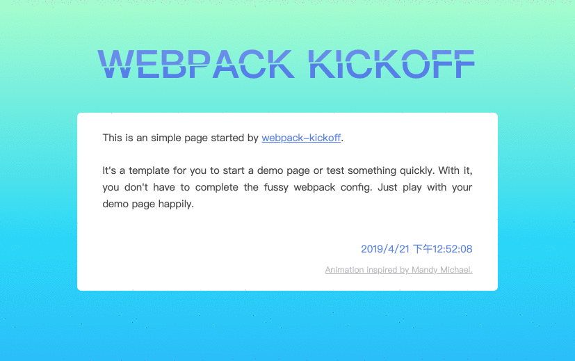

# webpack-kickoff-template

Help you to quickly start a project based on [Webpack](https://webpack.js.org/).

In my work, I often need to start a tiny demo quickly to

- try a npm lib by `import`
- test/try a webpack plugin or loader
- write a demo page for some features
- ……

Without configuring Wepack, `generator-webpack-kickoff` makes these more simple.

